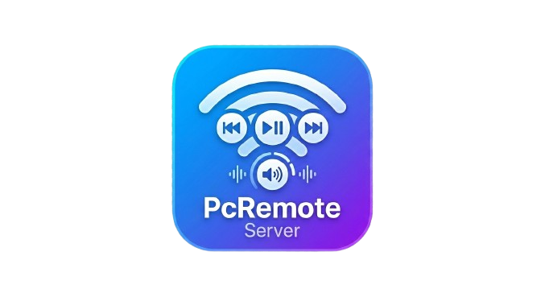

# PC Remote Control

[]()
[]()

Control your PC's volume and media playback from your Android device over your local network — with TLS encryption and automatic server discovery.

---

## Features

- **Volume Control** — Adjust system volume (0–100%) remotely
- **Media Playback** — Play/Pause, Next/Previous track
- **Auto-Discovery** — Android app finds your PC on the LAN via UDP multicast
- **TLS Encryption** — All communication encrypted with a self-signed certificate
- **Modern Dark UI** — Windows server has a neon-themed borderless WPF interface with animated status, colored event log, and system tray support
- **Easy Setup** — Windows installer (Next → Next → Finish) and Android APK
- **System Tray** — Server minimizes to tray; fully quit from tray menu

---

## Architecture

```
┌──────────────────────┐         TCP/TLS         ┌──────────────────────┐
│   Windows Server     │◄──────────────────────►│   Android App        │
│   (WPF .NET 8)       │      port 19090         │   (Kotlin/Compose)   │
│                      │                         │                      │
│  ┌────────────────┐  │   UDP multicast         │  ┌────────────────┐  │
│  │ DiscoveryService│  │◄──────────────────────►│  │ DiscoveryClient│  │
│  └────────────────┘  │  239.255.255.250:4096   │  └────────────────┘  │
│                      │                         │                      │
│  ┌────────────────┐  │                         │  ┌────────────────┐  │
│  │ TcpServerService│  │   JSON commands         │  │ TcpClient      │  │
│  │ VolumeController│  │   VolumeSet, MediaPlay  │  │ (ViewModel)    │  │
│  │ MediaKeyCtrl    │  │   MediaNext, etc.       │  └────────────────┘  │
│  └────────────────┘  │                         │                      │
└──────────────────────┘                         └──────────────────────┘
```

### Communication Protocol

| Direction | Message | Payload |
|-----------|---------|---------|
| Client → Server | `VolumeSet` | `{"command":"VolumeSet","value":75}` |
| Client → Server | `MediaPlay` | `{}` |
| Client → Server | `MediaPause` | `{}` |
| Client → Server | `MediaNext` | `{}` |
| Client → Server | `MediaPrevious` | `{}` |
| Client → Server | `BrightnessGet` | `{}` (connection verification ping) |
| Server → Client | Response | `{"status":"ok","value":75}` |

---

## Screenshots

| Windows Server | Android App |
|---|---|
|  | *(Android app screenshots to be added)* |

---

## Getting Started

### 1. Windows Server

**Option A — Installer (Recommended)**

1. Download [`PC-Remote-Listener-Setup-v1.0.exe`](release/PC-Remote-Listener-Setup-v1.0.exe)
2. Run the installer (admim rights required for volume/media key access)
3. Accept the EULA, follow the wizard, launch the app
4. The server appears in your system tray — open it to see connection info

**Option B — Build from Source**

Requirements:
- [.NET 8 SDK](https://dotnet.microsoft.com/download/dotnet/8.0)
- Windows 10/11

```bash
cd exe_final/PCRemoteListener
dotnet run
```

To publish a single-file executable:
```bash
dotnet publish -c Release -r win-x64 --self-contained true -p:PublishSingleFile=true
```

The published EXE will be at `bin/Release/net8.0-windows/win-x64/publish/PCRemoteListener.exe`

### 2. Android App

**Option A — Install APK**

1. Download [`PC-Remote-App-v1.0.apk`](PC-Remote-App-v1.0.apk)
2. On your Android device, enable "Install from unknown sources"
3. Open the APK file and install
4. Grant the `INTERNET` and `ACCESS_NETWORK_STATE` permissions when prompted

**Option B — Build from Source**

Requirements:
- [Android Studio](https://developer.android.com/studio)
- Android SDK 24+

```bash
cd apk_final/PCRemoteApp
./gradlew assembleDebug
```

The APK will be at `app/build/outputs/apk/debug/app-debug.apk`

---

## Connecting

1. Make sure both devices are on the same local network
2. Launch PC Remote Listener on Windows (note the IP addresses in the status panel)
3. Open PC Remote App on Android
4. Tap **"Discover PCs on Network"** or enter your PC's IP address manually
5. Set the port to `19090`
6. Ensure **TLS is enabled** on both devices (default)
7. Tap **Connect**

### TLS Certificate

The server generates a self-signed RSA 4096-bit certificate on first launch (stored in `%LOCALAPPDATA%/PCRemoteListener/`). To copy the certificate for verification:

1. In the server window, click **Copy Certificate** (footer)
2. The PEM certificate is copied to your clipboard
3. You can verify it in the Android app's settings if needed

---

## Security

- **TLS 1.3** encryption is enabled by default
- Self-signed certificate auto-generated on first run (4096-bit RSA)
- Disable TLS from the server UI (not recommended for production)
- The server binds to all network interfaces on port 19090
- Auto-discovery uses UDP multicast (limited to local network)
- **Run behind a firewall** — do not expose port 19090 to the internet

---

## Troubleshooting

| Issue | Solution |
|-------|----------|
| Can't connect | Both devices must be on the same subnet. Check Windows Firewall. |
| Auto-discovery fails | Enter the PC's IP address manually. Some routers block UDP multicast. |
| Volume not working | Run the server as administrator. |
| Connection refused | Verify TLS mode matches (both on or both off). |
| Old process blocks build | Run `taskkill /f /im PCRemoteListener.exe` before rebuilding. |

---

## Project Structure

```
├── release/                          # Pre-built binaries
│   ├── PC-Remote-Listener-Setup-v1.0.exe
│   ├── PC-Remote-App-v1.0.apk
│   └── server-preview.png
│
├── exe_final/
│   └── PCRemoteListener/             # Windows server (WPF / .NET 8)
│       ├── MainWindow.xaml(.cs)      # Dark neon UI
│       ├── Services/
│       │   ├── TcpServerService.cs   # TCP/TLS server
│       │   ├── VolumeController.cs   # NAudio volume control
│       │   ├── MediaKeyController.cs # SendInput media keys
│       │   ├── DiscoveryService.cs   # UDP multicast responder
│       │   └── CertificateService.cs # Self-signed cert generation
│       └── installer/                # Inno Setup installer package
│
└── apk_final/
    └── PCRemoteApp/                  # Android app (Kotlin / Compose)
        ├── app/src/main/java/com/pcremote/
        │   ├── MainActivity.kt       # Entry point
        │   ├── RemoteViewModel.kt    # Connection & state management
        │   ├── service/
        │   │   ├── TcpClient.kt      # TLS/plain TCP client
        │   │   └── DiscoveryClient.kt# UDP multicast discovery
        │   └── ui/
        │       ├── MainScreen.kt     # Full Compose UI
        │       └── EulaScreen.kt     # License agreement screen
        └── app/build/outputs/apk/    # Build artifacts
```

---

## Tech Stack

### Windows Server
- **.NET 8** with WPF
- **NAudio** — system volume control via Windows Core Audio API
- **SendInput** — media key simulation (virtual key codes)
- **Inno Setup 6** — installer creation

### Android App
- **Kotlin** with Jetpack Compose
- **DatagramSocket / Socket** — network communication
- **Coroutines** — async network operations

---

## Disclaimer

**This is a "vibe coded" project** — created through a combination of developer guidance and AI-assisted code generation.

THE SOFTWARE IS PROVIDED "AS IS", WITHOUT WARRANTY OF ANY KIND. The author is NOT responsible for any damage to your system, data loss, or security breaches resulting from the use of this software. This software allows remote control of your computer over a network — you are solely responsible for securing your network and ensuring that only authorized users have access.

See the [EULA](exe_final/installer/eula.txt) for full terms.

---

## Author

**Sebai Mohamed Safa**

---

## License

This project is provided for personal, non-commercial use. See the [EULA](exe_final/installer/eula.txt) for details.
